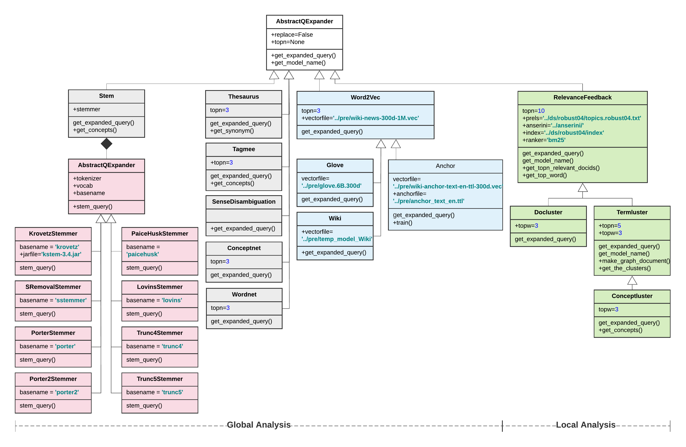

# A Toolkit for Generating Query Refinement Gold Standards
## [Online Video Tutorial](https://watch.wave.video/reque-a-toolkit-for-generating-query-refinement-gold-standards-5ef6c24046e0fb000c354004)
<p align="center">
    
    <br>
    Workflow Diagram
    
    <br>
    Class Diagram for Query Expanders in <a href="./qe">qe/</a>. [<a href="https://app.lucidchart.com/documents/view/64fedbb0-b385-4696-9adc-b89bc06e84ba/HWEp-vi-RSFO">zoom in!</a>]
    <br>
    The expanders are initialized by the Expander Factory in <a href="./qe/cmn/expander_factory.py">qe/cmn/expander_factory.py</a>
</p>


## Overview [`<o>`](./tree.txt)
### Codebases
[`qe/`](./qe/): (**q**uery **e**xpander) source code for the expanders `E={q}`.

``` 
+---qe
|   |   main.py
|   +---cmn
|   +---eval
|   +---expanders
|   |       abstractqexpander.py
|   |       ...
|   \---stemmers
|           abstractstemmer.py
|           ...
```

[`qs/`](./qs/): (**q**uery **s**uggester) source code from [cair](https://github.com/wasiahmad/context_attentive_ir) for the supervised query refinement methods (suggesters), including [seq2seq](https://nlp.stanford.edu/pubs/emnlp15_attn.pdf), [acg](https://arxiv.org/abs/1708.03418)(seq2seq + attn.), and [hred-qs](https://arxiv.org/abs/1507.02221).

```
+---qs
    |   main.py
    \---cair
```

### Source Folders [empty]
The following source folders are to be populated by the Salaam,

I thought about the idea that we discussed. 

The only issue that I think we might face is that the T5 transformer, learns the queries from the documents i.e, it selects terms from the document most of the time, and it also adds some terms that are common  among the queries ( Who which what , ... basically converting the selected terms into sentences) . I was wondering when we want to teach T5 to convert queries to queries, it might not perform well, since the common terms are not many, and it should learn to add lots of words. We might try and see how good T5 can perform with those limited terms. 

Another possible approach ( I think we discussed it before ) might be to generate Queries from the top-retrieved documents , use the generated queries to expand the initial query. It is not as complicated and as interesting as Ebrahim's idea, However, I have a feeling that will work well ! Also, implementation of this one does not require TPU Since we can use the trained model on GPU. It might be a good staring point.  query dataset `Q`, judment relevances `Jq`, and pre-trained models/embeddings.

[`pre/`](./pre/): (**pre**-trained models) source folder for pre-trained models and/or embeddings, including [FastText](https://fasttext.cc/docs/en/english-vectors.html) and [GloVe](https://nlp.stanford.edu/projects/glove/).

```
+---pre
|       # anchor_text_en.ttl                => http://downloads.dbpedia.org/2016-10/core-i18n/en/anchor_text_en.ttl.bz2
|       # glove.6B.300d.txt                 => http://nlp.stanford.edu/data/glove.6B.zip
|       # wiki-news-300d-1M.vec             => https://dl.fbaipublicfiles.com/fasttext/
|       # temp_model_Wiki                   => https://www.aclweb.org/anthology/C16-1252/
|       # temp_model_Wiki.vectors.npy       
|       # wiki-anchor-text-en-ttl-300d.vec  => https://github.com/hosseinfani/ReQue/blob/df3bcbdc3189a936f39ade0743450b7871e35517/qe/expanders/anchor.py#L22
|       # wiki-anchor-text-en-ttl-300d.vec.vectors.npy
```

[`anserini/`](./anserini/): source folder for [anserini](https://github.com/castorini/anserini), indexes for the information corpuses, and [trec_eval](https://github.com/usnistgov/trec_eval).

```
+---anserini 
|   +---eval
|   |   \---trec_eval.9.0.4
|   \---target
|       +---appassembler
|       |   +---bin
```

[`ds/`](./ds/): (**d**ata**s**et) source folder for original query datasets, including [Robust04](https://trec.nist.gov/data_disks.html), [Gov2](http://ir.dcs.gla.ac.uk/test_collections/gov2-summary.htm), [ClueWeb09-B](http://lemurproject.org/clueweb09.php/), [ClueWeb12-B13](http://lemurproject.org/clueweb12/ClueWeb12-CreateB13.php), [Antique](https://arxiv.org/abs/1905.08957), and [DBPedia](https://dl.acm.org/doi/10.1145/3077136.3080751).

```
+---ds
|   +---robust04
|       \---lucene-index.robust04.pos+docvectors+rawdocs
|   +---clueweb09b
|   |   \---lucene-index.clueweb09b.pos+docvectors+rawdocs
|   +---clueweb12b13
|   |   \---lucene-index.clueweb12b13.pos+docvectors+rawdocs
|   +---gov2
|   |   \---lucene-index.gov2.pos+docvectors+rawdocs
|   +---antique
|   |   \---lucene-index-antique
|   +---dbpedia
|   |   \---lucene-index-dbpedia

```

### Target Folders
The target folders are the output repo for the expanders, gold standard datasets, and benchmarks.

[`ds/qe/`](./ds/qe/): output folder for expanders and **the gold standard datasets.**

```
+---ds
|   +---qe
|   |   +---clueweb09b
|   |   |       topics.clueweb09b.1-200.bm25.map.dataset.csv
|   |   |       topics.clueweb09b.1-200.qld.map.dataset.csv
|   |   +---clueweb12b13
|   |   |       topics.clueweb12b13.201-300.bm25.map.dataset.csv
|   |   |       topics.clueweb12b13.201-300.qld.map.dataset.csv
|   |   +---gov2
|   |   |       topics.gov2.701-850.bm25.map.dataset.csv
|   |   |       topics.gov2.701-850.qld.map.dataset.csv
|   |   |---robust04
|   |   |       topics.robust04.bm25.map.dataset.csv
|   |   |       topics.robust04.qld.map.dataset.csv
|   |   |---antique
|   |   |       topics.antique.bm25.map.dataset.csv
|   |   |       topics.antique.qld.map.dataset.csv
|   |   |---dbpedia
|   |   |       topics.dbpedia.bm25.map.dataset.csv
|   |   |       topics.dbpedia.qld.map.dataset.csv

```

[`ds/qe/eval/`](./ds/qe/eval): output folder for the reports on performance of expanders and statistics about the gold standard datasets.

```
+---ds
|   +---qe
|   |   \---eval
|   |           overall.stat.csv
```

[`ds/qs/`](./ds/qs/): output folder for suggesters. This folder contains the benchmark results only and the trained models are ignored due to their sizes.

```
+---ds
|   +---qs
|   |   +---all.topn5
|   |   +---clueweb09b.topn5
|   |   +---clueweb12b13.topn5
|   |   +---gov2.topn5
|   |   +---robust04.topn5
|   |   +---antique.topn5
|   |   \---dbpedia.topn5
```

## Prerequisites
### [anserini](https://github.com/castorini/anserini) (java 11+)
### [cair](https://github.com/wasiahmad/context_attentive_ir) (optional, needed for benchmark on suggesters)
### python 3.7 and the following packages:
```
pandas, scipy, numpy, requests, urllib
networkx, community, python-louvain
gensim, tagme, bs4, pywsd, nltk [stem, tokenize, corpus]
pyserini, pygaggle, pytorch
```
For the full list, refer to [`environment.yml`](./environment.yml). A conda environment, namely `ReQue`, can be created and activated by the following commands:
```
$> conda env create -f environment.yml
$> conda activate ReQue
```


### Pre-trained Models/Embeddings
- [FastText](https://fasttext.cc/docs/en/english-vectors.html)
- [GloVe](https://nlp.stanford.edu/projects/glove/)
- [Joint Embedding of Hierarchical Categories and Entities for Concept Categorization and Dataless Classification](https://www.aclweb.org/anthology/C16-1252/)

### Original Query Datasets
- [Robust04](https://trec.nist.gov/data_disks.html) [corpus, [topics](https://github.com/castorini/anserini/blob/master/src/main/resources/topics-and-qrels/topics.robust04.txt), [qrels](https://github.com/castorini/anserini/blob/master/src/main/resources/topics-and-qrels/qrels.robust04.txt)]
- [Gov2](http://ir.dcs.gla.ac.uk/test_collections/gov2-summary.htm) [corpus, [topics](https://github.com/castorini/anserini/blob/master/docs/regressions-gov2.md#retrieval), [qrels](https://github.com/castorini/anserini/blob/master/docs/regressions-gov2.md#retrieval)]
- [ClueWeb09-B](http://lemurproject.org/clueweb09.php/) [corpus, [topics](https://github.com/castorini/anserini/blob/master/docs/regressions-cw09b.md#retrieval), [qrels](https://github.com/castorini/anserini/blob/master/docs/regressions-cw09b.md#retrieval)]
- [ClueWeb12-B13](http://lemurproject.org/clueweb12/ClueWeb12-CreateB13.php) [corpus, [topics](https://github.com/castorini/anserini/blob/master/docs/regressions-cw12b13.md#retrieval), [qrels](https://github.com/castorini/anserini/blob/master/docs/regressions-cw12b13.md#retrieval)]
- [Antique](https://arxiv.org/abs/1905.08957) [[corpus](https://ciir.cs.umass.edu/downloads/Antique/antique-collection.txt), [topics](https://ciir.cs.umass.edu/downloads/Antique/antique-test-queries.txt), [qrels](https://ciir.cs.umass.edu/downloads/Antique/antique-test.qrel)]
- [DBPedia](https://dl.acm.org/doi/10.1145/3077136.3080751) [[corpus](https://iai-group.github.io/DBpedia-Entity/), [topics](https://github.com/iai-group/DBpedia-Entity/blob/master/collection/v2/queries-v2.txt), [qrels](https://github.com/iai-group/DBpedia-Entity/blob/master/collection/v2/qrels-v2.txt)]
- [Wikipedia Anchor Text](http://downloads.dbpedia.org/2016-10/core-i18n/en/anchor_text_en.ttl.bz2)

- **Supported Corpora:** It should be noted that although ReQue supports  the above-mentioned datasets, is not fully dependent on them.  In addition to ```Trec```, ```TrecWebCollection```, ```Clueweb09Collection```, ```Cluweb12Collection```, ```TsvString``` and ```TsvInt``` collection structure which is already suported by Anserini, ReQue can be applied to any TSV format collection as far as the corpus and the queries are in ```docid\tdocument```  and ```qid\query``` format, respectively. The TSV format collection can be converted to Jsoncollection and then indexed as per instructed in [Anserini](https://github.com/castorini/anserini/blob/master/docs/experiments-msmarco-passage.md).  


## Installing
It is suggested to clone the repo and install a new conda environment along with the required packages using yaml configuration file by the following commands:

```
$> git clone https://github.com/hosseinfani/ReQue.git
$> cd ReQue
$> conda env create -f environment.yml
$> conda activate ReQue
```

[Anserini](https://github.com/castorini/anserini) must be installed in [`anserini/`](./anserini/) for indexing, information retrieval and ranking, and evaluation on the original query datasets. The documents in the corpus must be indexed, e.g., by the following commands for `Robust04` (already available [here](https://git.uwaterloo.ca/jimmylin/anserini-indexes/raw/master/index-robust04-20191213.tar.gz)), `Gov2`, `ClueWeb09-B`, and `ClueWeb12-B13`.

For `Antique` dataset, we first need to convert the antique tsv files into tsv into Anserini's jsonl files as per instructed [here](https://github.com/castorini/anserini/blob/master/docs/experiments-msmarco-passage.md), 

For `DBPedia` dataset, you may use [Nordlys toolkit](https://nordlys.readthedocs.io/en/latest/installation.html) in order to download MongoDB DBpedia cleaned collection. Later, you can index it using elastic search or convert it into tsv format and index it using [Anserini](https://github.com/castorini/anserini/blob/master/docs/experiments-msmarco-passage.md).

Further, we can use the following commands to index the documents: 

```
$> anserini/target/appassembler/bin/IndexCollection -collection TrecCollection -input Robust04-Corpus -index lucene-index.robust04.pos+docvectors+rawdocs -generator JsoupGenerator -threads 44 -storePositions -storeDocvectors -storeRawDocs 2>&1 | tee log.robust04.pos+docvectors+rawdocs &
$> anserini/target/appassembler/bin/IndexCollection -collection TrecwebCollection -input Gov2-Corpus -index lucene-index.gov2.pos+docvectors+rawdocs -generator JsoupGenerator -threads 44 -storePositions -storeDocvectors -storeRawDocs 2>&1 | tee log.gov2.pos+docvectors+rawdocs &
$> anserini/target/appassembler/bin/IndexCollection -collection ClueWeb09Collection -input ClueWeb09-B-Corpus -index lucene-index.cw09b.pos+docvectors+rawdocs -generator JsoupGenerator -threads 44 -storePositions -storeDocvectors -storeRawDocs 2>&1 | tee  log.cw09b.pos+docvectors+rawdocs &
$> anserini/target/appassembler/bin/IndexCollection -collection ClueWeb12Collection -input ClueWeb12-B-Corpus -index lucene-index.cw12b13.pos+docvectors+rawdocs -generator JsoupGenerator -threads 44 -storePositions -storeDocvectors -storeRawDocs 2>&1 | tee  log.cw12b13.pos+docvectors+rawdocs &
$> anserini/target/appassembler/bin/IndexCollection -collection JsonCollection -input antique-Corpus -index lucene-index-antique -generator DefaultLuceneDocumentGenerator -threads 1 -storePositions -storeDocvectors -storeRaw 2>&1 | tee  log.antique.pos+docvectors+rawdocs &
$> anserini/target/appassembler/bin/IndexCollection -collection JsonCollection -input dbpedia-collection -index lucene-index-dbpedia -generator DefaultLuceneDocumentGenerator -threads 1 -storePositions -storeDocvectors -storeRaw 2>&1 | tee  log.dbpedia.pos+docvectors+rawdocs &
 
```

## ReQue: Refining Queries: [`qe/`](./qe/)
Refining queries is done using all [expanders](./qe/cmn/expander_factory.py) by [`qe/main.py`](./qe/main.py) that accept the following arguments:

`--corpus`: The name of the original query dataset whose queries are to be expanded and paired with the refined queries, if any, which could be one of {`robust04`, `gov2`, `clueweb09b`, `clueweb12b13`, `antique`, `dbpedia`}. Required;

`--output`: The output path for the gold standard dataset, e.g., [`../ds/qe/robust04/`](./ds/qe/robust04/). Required; 

`--ranker`: The ranker name which could be any of the available ranker models in [anserini](https://github.com/castorini/anserini)([SearchCollection](https://github.com/matthew-z/Anserini/blob/master/src/main/java/io/anserini/search/SearchArgs.java)). ReQue has been tested for {`bm25`,`qld`} (default: bm25);

`--metric`: The evaluation metric name which could be any metric from [trec_eval](https://github.com/usnistgov/trec_eval). Currently, ReQue has been tested for mean average precision, (default: `map`);

There are other required parameters that should be set in [params.py](https://github.com/hosseinfani/ReQue/blob/develop/qe/cmn/param.py) for each collection, including:

`anserini`: The path to the anserini library e.g., [`../anserini/`](https://github.com/hosseinfani/ReQue/blob/ac1b9557a88faa15e8d0c50f934a03a56b9318f6/qe/cmn/param.py#L14); Required.

`index`: The corpus index, e.g. [`../ds/robust04/lucene-index.robust04.pos+docvectors+rawdocs`](https://github.com/hosseinfani/ReQue/blob/ac1b9557a88faa15e8d0c50f934a03a56b9318f6/qe/cmn/param.py#L19); Required

`size`: Number of documents in the collection e.g., [`528155`](https://github.com/hosseinfani/ReQue/blob/cfa7eddcb526bd0f82acda77505010a804df884f/qe/cmn/param.py#L20); Required for Onfields and AdapOnFields query expander.

`w_t`: Weight for title field. Required for Onfields and AdapOnFields query expander.

`w_a`: Weight for anchor field. Required for Onfields and AdapOnFields query expander.

`tokens`:  Total number of tokens in the collection e.g., [`148000000`](https://github.com/hosseinfani/ReQue/blob/cfa7eddcb526bd0f82acda77505010a804df884f/qe/cmn/param.py#L25); Required for Onfields and AdapOnFields query expander.

The sample running commands are:

```
$> python -u main.py --corpus robust04 --output ../ds/qe/robust04/ --ranker bm25 --metric map 2>&1 | tee robust04.bm25.log &
$> python -u main.py --corpus robust04 --output ../ds/qe/robust04/ --ranker qld --metric map 2>&1 | tee robust04.qld.log &

$> python -u main.py --corpus gov2 --output ../ds/qe/gov2/ --ranker bm25 --metric map 2>&1 | tee gov2.bm25.log &
$> python -u main.py --corpus gov2 --output ../ds/qe/gov2/ --ranker qld --metric map 2>&1 | tee gov2.qld.log &

$> python -u main.py --corpus clueweb09b --output ../ds/qe/clueweb09b/ --ranker bm25 --metric map 2>&1 | tee clueweb09b.bm25.log &
$> python -u main.py --corpus clueweb09b --output ../ds/qe/clueweb09b/ --ranker qld --metric map 2>&1 | tee clueweb09b.qld.log &

$> python -u main.py --corpus clueweb12b13 --output ../ds/qe/clueweb12b13/ --ranker bm25 --metric map 2>&1 | tee clueweb12b13.bm25.log &
$> python -u main.py --corpus clueweb12b13 --output ../ds/qe/clueweb12b13/ --ranker qld --metric map 2>&1 | tee clueweb12b13.qld.log &

$> python -u main.py --corpus antique --output ../ds/qe/antique/ --ranker bm25 --metric map 2>&1 | tee antique.bm25.log &
$> python -u main.py --corpus antique --output ../ds/qe/antique/ --ranker qld --metric map 2>&1 | tee antique.qld.log &

$> python -u main.py --corpus dbpedia --output ../ds/qe/dbpedia/ --ranker bm25 --metric map 2>&1 | tee dbpedia.bm25.log &
$> python -u main.py --corpus dbpedia --output ../ds/qe/dbpedia/ --ranker qld --metric map 2>&1 | tee dbpedia.qld.log &
```

## Gold Standard Dataset: [`ds/qe/`](./ds/qe/)
### Path
The gold standard dataset for each original query dataset is generated in `ds/qe/{original query dataset}/*.{ranker}.{metric}.dataset.csv`.

### File Structure
The columns in the gold standard dataset are:

- `qid`: the original query id in the input query dataset;

- `abstractqueryexpansion`: the original query `q`;

- `abstractqueryexpansion.{ranker}.{metric}`: the original evaluation value `r_m(q, Jq)` for a ranker `r` in terms of an evaluation metric `m`;

- `star_model_count`: number of refined queries `0 <= |R_qrm| <= |E|` for the original query `q` that improve the original evaluation value;

- `expander.{i}`: the name of the expander `e_i` that revised the original query and improved the original evaluation value;

- `metric.{i}`: the evaluation value `r_m(q'_i, Jq)` of the refined query `q'_i`. 

- `query.{i}`: the refined query `q'_i`;

and `0 <= i <= star_model_count`. **The refined queries are listed in order of descending values.**

### Example
The golden standard dataset for `Robust04` using the ranker `bm25` and based on the evaluation metric `map` (mean average precision) is [`ds/qe/robust04/topics.robust04.bm25.map.dataset.csv`](./ds/qe/robust04/topics.robust04.bm25.map.dataset.csv) and, for instance, includes:

```
311,Industrial Espionage,0.4382,1,relevancefeedback.topn10.bm25,0.489,industrial espionage compani bnd mr foreign intellig samsung vw mossad
```

where there is only `1` refined query for the query# `311`. The original query `Industrial Espionage` is revised to `industrial espionage compani bnd mr foreign intellig samsung vw mossad` by `relevancefeedback`, and the `map` is improved from `0.4382` (original map) to `0.489`.

Another instance is:

```
306,African Civilian Deaths,0.1196,0
```

that is no available expander was able to revise the query# `306` such that the revise query improve the performance of ranker `bm25` in terms of `map`.

## Benchmark Supervised Query Refinement Method: [`qs/`](./qs/)
[Cair](https://github.com/wasiahmad/context_attentive_ir) by [Ahmad et al. sigir2019](https://dl.acm.org/doi/abs/10.1145/3331184.3331246) has been used to benchmark the gold standard datasets for [seq2seq](https://nlp.stanford.edu/pubs/emnlp15_attn.pdf), [acg](https://arxiv.org/abs/1708.03418)(seq2seq + attn.), [hred-qs](https://arxiv.org/abs/1507.02221). 

The [`qs/main.py`](./qs/main.py) accepts a positive integer `n`, for considering the topn refined queries, and the name of the original query dataset. `n` may be chosen to be a large number, e.g., `n=100` to consider all the refined queries.

Sample commands for top-5 are:
```
$> python -u qs/main.py 5 robust04 2>&1 | tee robust04.topn5.log &
$> python -u qs/main.py 5 gov2 2>&1 | tee gov2.topn5.log &
$> python -u qs/main.py 5 clueweb09b 2>&1 | tee clueweb09b.topn5.log &
$> python -u qs/main.py 5 clueweb12b13 2>&1 | tee clueweb12b13.topn5.log &
$> python -u qs/main.py 5 antique 2>&1 | tee antique.topn5.log &
$> python -u qs/main.py 5 dbpedia 2>&1 | tee dbpedia.topn5.log &
```

By passing `all` as the name of the original query dataset, it is also possible to merge all the gold standard datasets and do the benchmark:
```
$> python -u qs/main.py 5 all 2>&1 | tee all.topn5.log &
```
## Performance Evaluation on Generated Gold Standard Datasets for the TREC collections
### Statistics: [`ds/qe/eval/`](./ds/qe/eval) 
Statistics shows that for all the rankers, at least `1.44` refined queries exists on average for an original query while the best performance is for `Robust04` over `bm25` with `4.24`. 

|            |avg \|Rqrm\||        |
|------------|------------|--------|	
|            |bm25        |qld     |
|robust04    |xxxx        |xxxx    |
|gov2        |xxxx        |xxxx    |
|clueweb09b  |xxxx        |xxxx    |
|clueweb12b13|xxxx        |xxxx    |
|antique     |xxxx        |xxxx    |
|dbpedia     |xxxx        |xxxx    |

The average `map` improvement rate is also reported, given the best refined query for each original query.  As shown, the minimum value of `map` improvement is greater than `100%` for all the gold standard datasets which means that even in the worst case, the best refined query for an original query almost **doubled** the performance of the ranker in terms of `map` while the gold standard datasets for `clueweb09b` have improvement rate close or greater than `1000%`, meaning that, on average, the best refined query improved each original query by a factor of `10` in that datasets.

|            |average `map` improvement rate (%)|   |
|------------|----------------------------------|---|	
|            |bm25                              |qld|
|robust04    |xxxx                              |xxxx|
|gov2        |xxxx                              |xxxx|
|clueweb09b  |xxxx                              |xxxx|
|clueweb12b13|xxxx                              |xxxx|
|antique     |xxxx                              |xxxx|
|dbpedia     |xxxx                              |xxxx|


### Benchmarks: [`ds/qs/`](./ds/qs)
For each gold standard dataset belonging to ReQue, given the pairs `{(q, q') | q ∈ Q, q' ∈ Rqrm}`, the performance of three state-of-the-art supervised query refinement methods including [seq2seq](https://nlp.stanford.edu/pubs/emnlp15_attn.pdf), [acg](https://arxiv.org/abs/1708.03418)(seq2seq + attn.), [hred-qs](https://arxiv.org/abs/1507.02221) after running the models for 100 epochs has been reported in terms of rouge-l and bleu.  As shown, in all the cases, [acg](https://arxiv.org/abs/1708.03418)(seq2seq + attn.) and [hred-qs](https://arxiv.org/abs/1507.02221) outperform [seq2seq](https://nlp.stanford.edu/pubs/emnlp15_attn.pdf) in terms of all the evaluation metric,  in most cases, [acg](https://arxiv.org/abs/1708.03418)(seq2seq + attn.) that uses the attention mechanism outperform [hred-qs](https://arxiv.org/abs/1507.02221). The similar observation is also reported by [Ahmad et al. Context Attentive Document Ranking and Query Suggestion](https://github.com/wasiahmad/context_attentive_ir) and [Dehghani et al. Learning to Attend, Copy, and Generate for Session-Based Query Suggestion](https://dl.acm.org/doi/pdf/10.1145/3132847.3133010). 

Given a gold standard dataset which is built for an original query dataset for a ranker and a metric, the full report can be found here: `ds/qs/{original query dataset}.topn5/topics.{original query dataset}.{ranker}.{metric}.results.csv`. For instance, for [`ds/qe/robust04/topics.robust04.bm25.map/dataset.csv`](./ds/qe/robust04/topics.robust04.bm25.map.dataset.csv) the benchmarks are in [`ds/qs/robust04.topn5/topics.robust04.bm25.map/results.csv`](./ds/qs/robust04.topn5/topics.robust04.bm25.map/results.csv)
|				|			|seq2seq	|			|acg		|		|hred-qs	|		|
|---------------|-----------|-----------|-----------|-----------|-------|-----------|-------|
|				|ranker		|rouge-l	|bleu		|rouge-l	|bleu	|rouge-l	|bleu 	|
|robust04		|bm25		|xxxxxx		|xxxxxx		|xxxxxx		|xxxxxx |xxxxxx  	|xxxxxx |
|				|qld		|xxxxxx		|xxxxxx		|xxxxxx		|xxxxxx |xxxxxx  	|xxxxxx |
|gov2			|bm25		|xxxxxx		|xxxxxx		|xxxxxx		|xxxxxx |xxxxxx  	|xxxxxx |
|				|qld		|xxxxxx		|xxxxxx	    |xxxxxx		|xxxxxx |xxxxxx  	|xxxxxx |
|clueweb09b		|bm25		|xxxxxx		|xxxxxx		|xxxxxx		|xxxxxx |xxxxxx  	|xxxxxx |
|				|qld		|xxxxxx		|xxxxxx		|xxxxxx	    |xxxxxx |xxxxxx  	|xxxxxx |
|clueweb12b13	|bm25		|xxxxxx		|xxxxxx		|xxxxxx		|xxxxxx |xxxxxx  	|xxxxxx |
|				|qld		|xxxxxx		|xxxxxx	    |xxxxxx		|xxxxxx |xxxxxx  	|xxxxxx |
|antiqu     	|bm25		|xxxxxx		|xxxxxx		|xxxxxx		|xxxxxx |xxxxxx  	|xxxxxx |
|				|qld		|xxxxxx		|xxxxxx		|xxxxxx		|xxxxxx |xxxxxx  	|xxxxxx |
|dbpedia    	|bm25		|xxxxxx		|xxxxxx		|xxxxxx		|xxxxxx |xxxxxx  	|xxxxxx |
|				|qld		|xxxxxx		|xxxxxx		|xxxxxx		|xxxxxx |xxxxxx  	|xxxxxx |


## Authors
[Hossein Fani](https://sites.google.com/site/hosseinfani/)<sup>1</sup>, [Negar Arabzadeh](https://github.com/Narabzad)<sup>2</sup>, [Mahtab Tamannaee](https://github.com/mtamannaee)<sup>2</sup>, [Fattane Zarrinkalam](http://ls3.rnet.ryerson.ca/people/fattane_zarrinkalam/)<sup>2</sup>, [Jamil Samouh](https://github.com/jamilsamouh)<sup>2</sup>, [Samad Paydar](http://s-paydar.profcms.um.ac.ir/)<sup>2</sup> and [Ebrahim Bagheri](https://www.ee.ryerson.ca/~bagheri/)<sup>2</sup>

<sup><sup>1</sup>School of Computer Science, Faculty of Science, University of Windsor, ON, Canada.</sup>

<sup><sup>2</sup>Laboratory for Systems, Software and Semantics ([LS3](http://ls3.rnet.ryerson.ca/)), Ryerson University, ON, Canada.</sup>

## Citation
```
@inproceedings{ReQue,
  author    = {Mahtab Tamannaee and
               Hossein Fani and
               Fattane Zarrinkalam and
               Jamil Samouh and
               Samad Paydar and
               Ebrahim Bagheri},
  title     = {ReQue: A Configurable Workflow and Dataset Collection for Query Refinement},
  booktitle = {{CIKM} '20: The 29th {ACM} International Conference on Information and Knowledge Management, Virtual Event, Ireland, October 19-23, 2020},
  pages     = {3165--3172},
  publisher = {{ACM}},
  year      = {2020},
  url       = {https://doi.org/10.1145/3340531.3412775},
  doi       = {10.1145/3340531.3412775}
  }
```

## License
©2020. This work is licensed under a [CC BY-NC-SA 4.0](LICENSE.txt) license. 

## Acknowledgments
We benefited from codebases of [cair](https://github.com/wasiahmad/context_attentive_ir) and [anserini](https://github.com/castorini/anserini). We would like to expresse our gratitdue for authors of these repositeries.
