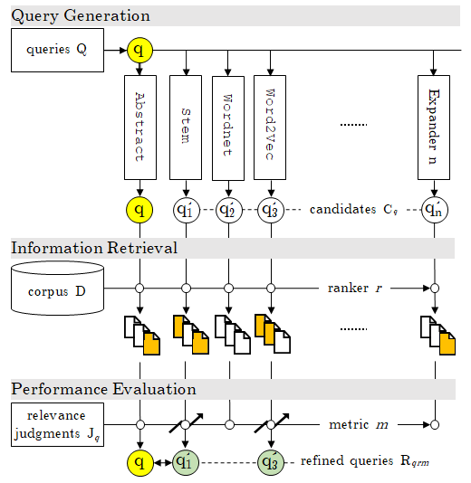

# ReQue: A Benchmark Workflow and Dataset Collection for Query Refinement
<div align="center">
    
</div>


## Overview
### Codebases
[`qe/`](./qe/): source code for the query expansion methods (**unsupervised query refinement methods**).

[`qs/`](./qs/): source code for the query suggestion methods (**supervised query refinement method**), including [anmt](https://nlp.stanford.edu/pubs/emnlp15_attn.pdf)(seq2seq), [acg](https://arxiv.org/abs/1708.03418)(seq2seq + attn.), [hred-qs](https://arxiv.org/abs/1507.02221).

### Source Folders [empty]
The following source folders are to be populated by input query datasets and pre-trained models/embeddings.

[`pre/`](./pre/): source folder for pre-trained models and/or embeddings, including [FastText](https://fasttext.cc/docs/en/english-vectors.html) and [GloVe](https://nlp.stanford.edu/projects/glove/).

[`anserini/`](./anserini/): source folder for [Anserini](https://github.com/castorini/anserini) and indices for the input query datasets.

[`ds/`](./ds/): source folder for input query datasets, including [Robust04](https://trec.nist.gov/data_disks.html), [Gov2](http://ir.dcs.gla.ac.uk/test_collections/gov2-summary.htm), [ClueWeb09-B](http://lemurproject.org/clueweb09.php/), and [ClueWeb12-B13](http://lemurproject.org/clueweb12/ClueWeb12-CreateB13.php).

### Target Folders
The target folders are the output repo for the query expansion methods (unsupervised query refinement methods) and query suggestion methods (unsupervised query refinement methods).

[`ds/qe/`](./ds/qe/): output folder for expanders. **This folder contains the gold standard datasets.**

[`ds/qs/`](./ds/qs/): output folder for suggesters. This folder contains the benchmark results only and the trained models are ignored due to their sizes.

## Prerequisites
### [Anserini](https://github.com/castorini/anserini)
### [Cair](https://github.com/wasiahmad/context_attentive_ir) (optional, needed for benchmark)
### Python 3.7 and the following packages:
```
pandas, scipy, numpy, collections, requests, urllib, subprocess
networkx, community
gensim, tagme, bs4, pywsd, nltk [stem, tokenize, corpus]
```
### Pre-trained Models/Embeddings
- [FastText](https://fasttext.cc/docs/en/english-vectors.html)
- [GloVe](https://nlp.stanford.edu/projects/glove/)
- [Joint Embedding of Hierarchical Categories and Entities for Concept Categorization and Dataless Classification](https://www.aclweb.org/anthology/C16-1252/)

### Input Query Dataset
- [Robust04](https://trec.nist.gov/data_disks.html) [corpus, [topics](https://github.com/castorini/anserini/blob/master/src/main/resources/topics-and-qrels/topics.robust04.txt), [qrels](https://github.com/castorini/anserini/blob/master/src/main/resources/topics-and-qrels/qrels.robust04.txt)]
- [Gov2](http://ir.dcs.gla.ac.uk/test_collections/gov2-summary.htm) [corpus, [topics](https://github.com/castorini/anserini/blob/master/docs/regressions-gov2.md#retrieval), [qrels](https://github.com/castorini/anserini/blob/master/docs/regressions-gov2.md#retrieval)]
- [ClueWeb09-B](http://lemurproject.org/clueweb09.php/) [corpus, [topics](https://github.com/castorini/anserini/blob/master/docs/regressions-cw09b.md#retrieval), [qrels](https://github.com/castorini/anserini/blob/master/docs/regressions-cw09b.md#retrieval)]
- [ClueWeb12-B13](http://lemurproject.org/clueweb12/ClueWeb12-CreateB13.php) [corpus, [topics](https://github.com/castorini/anserini/blob/master/docs/regressions-cw12b13.md#retrieval), [qrels](https://github.com/castorini/anserini/blob/master/docs/regressions-cw12b13.md#retrieval)]
- [Wikipedia Anchor Text](http://downloads.dbpedia.org/2016-10/core-i18n/en/anchor_text_en.ttl.bz2)

## Installing
[Anserini](https://github.com/castorini/anserini) must be installed in [`anserini/`](./anserini/) for indexing, information retrieval, and evaluation on the input query datasets. The documents in the corpus of the input query datasets must be indexed by the following commands:

### Robust04 (already available at [here](https://git.uwaterloo.ca/jimmylin/anserini-indexes/raw/master/index-robust04-20191213.tar.gz))
```
$> anserini/target/appassembler/bin/IndexCollection -collection TrecCollection -input Robust04-Corpus -index lucene-index.robust04.pos+docvectors+rawdocs -generator JsoupGenerator -threads 44 -storePositions -storeDocvectors -storeRawDocs 2>&1 | tee log.robust04.pos+docvectors+rawdocs &
```

### Gov2
```
$> anserini/target/appassembler/bin/IndexCollection -collection TrecwebCollection -input Gov2-Corpus -index lucene-index.gov2.pos+docvectors+rawdocs -generator JsoupGenerator -threads 44 -storePositions -storeDocvectors -storeRawDocs 2>&1 | tee log.gov2.pos+docvectors+rawdocs &
```

### ClueWeb09-B
```
$> anserini/target/appassembler/bin/IndexCollection -collection ClueWeb09Collection -input ClueWeb09-B-Corpus -index lucene-index.cw09b.pos+docvectors+rawdocs -generator JsoupGenerator -threads 44 -storePositions -storeDocvectors -storeRawDocs 2>&1 | tee  log.cw09b.pos+docvectors+rawdocs &
```

### ClueWeb12-B13
```
$> anserini/target/appassembler/bin/IndexCollection -collection ClueWeb12Collection -input ClueWeb12-B-Corpus -index lucene-index.cw12b13.pos+docvectors+rawdocs -generator JsoupGenerator -threads 44 -storePositions -storeDocvectors -storeRawDocs 2>&1 | tee  log.cw12b13.pos+docvectors+rawdocs &
```

## Query Expansion (Unsupervised Query Refinement Method): [`qe/`](./qe/)
Query expansion is done by [`qe/main.py`](./qe/main.py) that accept the name of the input query dataset whose queries are to be expanded and evaluated.
```
$> python -u qe/main.py robust04 2>&1 | tee robust04.log &
$> python -u qe/main.py gov2 2>&1 | tee gov2.log &
$> python -u qe/main.py clueweb09b 2>&1 | tee clueweb09b.log &
$> python -u qe/main.py clueweb12b13 2>&1 | tee clueweb12b13.log &
```

## Gold Standard Dataset: [`ds/qe/`](./ds/qe/)
### Path
The gold standard dataset for each input query dataset is generated in `ds/qe/{input query dataset name}/*.{retrieval method}.{metric}.dataset.csv`.

### File Structure
The columns in the gold standard dataset are:

- `qid`: the original query id in the input query dataset;

- `abstractqueryexpansion`: the original query;

- `abstractqueryexpansion.{retrieval method}.{metric}`: the original evaluation value for a retrieval method=[`bm25`, `bm25.rm3`, `qld`, `qld.rm3`] in terms of an evaluation metric=[`map`];

- `star_model_count`: number of golden expansions (optimal revised queries) that improve the original evaluation value. Equivalently, the number of golden expanded queries for the original query;

- `method.{i}`: the name of the i-th expansion method (expander) that expanded (revised) the original query and improved the original evaluation value;

- `metric.{i}`: the evaluation value of the i-th golden expanded query (optimal revised query);

- `query.{i}`: the i-th golden expanded query;

and `0 <= i <= star_model_count`.

### Example
The golden standard dataset for `Robust04` using the retrieval method `bm25` and based on the evaluation metric `map` (mean average precision) is [`ds/qe/robust04/topics.robust04.bm25.map.dataset.csv`](./ds/qe/robust04/topics.robust04.bm25.map.dataset.csv) and, for instance, includes:

```
311,Industrial Espionage,0.4382,1,relevancefeedback.topn10.bm25,0.489,industrial espionage compani bnd mr foreign intellig samsung vw mossad
```

where there is only `1` golden expanded query (optimal revised query) for the query# `311`. The original query `Industrial Espionage` is expanded (revised) to `industrial espionage compani bnd mr foreign intellig samsung vw mossad` by `relevancefeedback`, and the `map` is improved from `0.4382` (original map) to `0.489`.

Another instance is:

```
306,African Civilian Deaths,0.1196,0
```

that is no expansion method (expander) is able to improve (revise) the query# `306` using `bm25` retrieval method in terms of `map`.

## Benchmark Query Suggestion (Supervised Query Refinement Method): [`qs/`](./qs/)
[Cair](https://github.com/wasiahmad/context_attentive_ir) by [Ahmad et al. sigir2019](https://dl.acm.org/doi/abs/10.1145/3331184.3331246) has been used to benchmark the golden expanded queries for [anmt](https://nlp.stanford.edu/pubs/emnlp15_attn.pdf)(seq2seq), [acg](https://arxiv.org/abs/1708.03418)(seq2seq + attn.), [hred-qs](https://arxiv.org/abs/1507.02221). 

The [`qs/main.py`](./qs/main.py) accepts a positive integer `n`, for considering the topn golden expanded queries, and the name of the input query dataset. `n` may be chosen to be a large number, e.g., `n=100` to consider all the golden expanded queries.

Sample commands for top-5 are:
```
$> python -u qs/main.py 5 robust04 2>&1 | tee robust04.topn5.log &
$> python -u qs/main.py 5 gov2 2>&1 | tee gov2.topn5.log &
$> python -u qs/main.py 5 clueweb09b 2>&1 | tee clueweb09b.topn5.log &
$> python -u qs/main.py 5 clueweb12b13 2>&1 | tee clueweb12b13.topn5.log &
```

By passing `all` as the name of the input query dataset, it is also possible to merge all the input query datasets and do the benchmark:
```
$> python -u qs/main.py 5 all 2>&1 | tee all.topn5.log &
```
## Performance Evaluation
### Statistics on TREC collections
|||average \|Rqrm\||average `map` improvement rate (%)	
||\|Q\||bm25|qld|bm25|qld
|robust04|250|4.25|4.06|411.83|301.26
|gov2|150|2.49|2.15|104.31|101.77
|clueweb09b|200|1.44|1.67|945.22|1,751.58
|clueweb12b13|100|1.81|1.57|196.77|159.38

### Benchmarks

## Authors
## License
## Acknowledgments
We benefited from codebases of [cair](https://github.com/wasiahmad/context_attentive_ir) and [anserini](https://github.com/castorini/anserini). We would like to expresse our gratitdue for authors of these repositeries.
